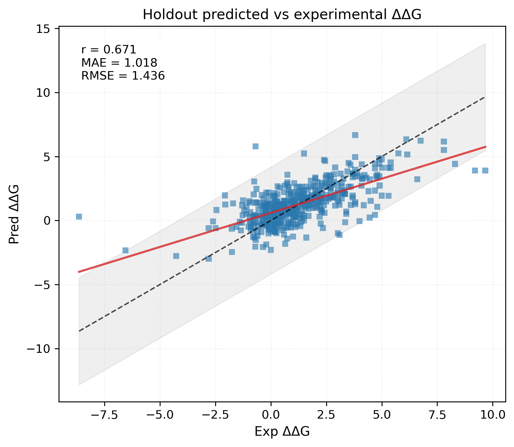

# AF2stab: AlphaFold2-based Point-Mutation Stability Prediction Pipeline


<font color=yellow>
<strong>
<em>
This repository provides a practical end-to-end workflow for predicting ΔΔG (point-mutation stability) from AlphaFold2 internal representations.


With the current engineering pipeline, the retained holdout result reaches **Pearson r = 0.671**, indicating that the AlphaFold2 **single representation** contains useful signal for learning mutation stability effects.

In this workflow, AlphaFold2 is used not only as a structure predictor, but also as a source of residue-level feature vectors for downstream ddG modeling.

</em>
</strong>
</font>

---

## Current result example

Below is one example figure generated by script **6**.

### Holdout predicted vs experimental ΔΔG



This figure shows the predicted-vs-experimental scatter trend of the current engineering baseline and is the closest paper-style result figure currently retained in this repository.

In this holdout result, the Pearson correlation reaches **r = 0.671**, suggesting that the AlphaFold2 **single representation** contains informative signal associated with experimental **ΔΔG** and can be used to learn mutation stability effects.

**In short, the workflow is:**

1. build a clean mutation dataset from FireProtDB,
2. generate WT and mutant FASTA files,
3. run AlphaFold2 on WT and mutant sequences,
4. extract the mutation-site **single representation** vectors,
5. construct the paper-style **1152-dimensional feature vector**,
6. train an MLP to predict experimental ΔΔG.

This repository is therefore **not** just a plain AlphaFold2 fork and **not** just a training script collection. It is a complete experimental pipeline connecting:

- dataset preparation,
- AlphaFold2 feature dumping,
- feature extraction,
- ddG model training,
- and result visualization.

---

## Important note: the original AlphaFold2 does **not** output the feature vectors we need

The original AlphaFold2 workflow does not directly save the internal residue-level feature vectors used in this project.

For this repository, the target feature is the **single representation** at the mutation site. That means the AlphaFold2 code must be modified so that it can:

1. request internal representations from the model,
2. expose a CLI switch for saving them,
3. write the `representations['single']` array to disk.

### The key modification points in this repository are:

- `alphafold2/run_alphafold.py`
- `alphafold2/docker/run_docker.py`

### What was added conceptually

#### 1. A new flag to enable saving the single representation

In this repository, the AlphaFold2 runner supports a switch like:

```bash
--save_single_representation=true
```

#### 2. The model call is configured to return internal representations

The modified runner requests AlphaFold2 internal representations instead of only the standard structure outputs.

#### 3. The residue-level single representation is written to disk

When enabled, the modified runner saves files like:

```text
single_repr_model_1_pred_0.npy
```

inside the output directory of each WT or mutant target.

### Why this matters

Without this modification, you can still get predicted structures from AlphaFold2, but you **cannot** directly reproduce the paper-style learning setup used here, because the MLP in this repository depends on those internal vectors.

So if you use a stock AlphaFold2 checkout, the downstream scripts in this repository will not be enough by themselves.

---

## Main workflow scripts

The current canonical workflow uses **6 scripts**.

### 1. Build the clean phase-1 FireProtDB ddG dataset

```bash
python scripts/1.prepare_fireprotdb_phase1_dataset.py
```

What it does:

- reads `dataset/fireprotdb_results.csv`
- filters invalid mutation records
- validates sequence / position / WT consistency
- collapses duplicate experiments using median ddG
- writes the clean mutation table

Main outputs:

- `data/processed/fireprotdb_phase1_ddg_clean.csv`
- `data/processed/fireprotdb_phase1_ddg_summary.json`

---

### 2. Build WT / mutant FASTAs and the AF2 manifest

```bash
python scripts/2.build_mutant_fastas.py
```

What it does:

- generates WT FASTA files
- generates mutant FASTA files
- builds the full AF2 manifest tying samples to sequence files

Main outputs:

- `data/interim/fasta/wild_type/`
- `data/interim/fasta/mutant/`
- `data/manifests/fireprotdb_phase1_af2_manifest.csv`
- `data/manifests/fireprotdb_phase1_af2_manifest_summary.json`

---

### 3. Prepare the full AlphaFold2 single-representation run

```bash
python scripts/3.prepare_full_single_repr_run.py
```

What it does:

- reads the AF2 manifest
- expands WT and mutant tasks
- generates a 4-GPU shell runner
- ensures the run is configured to save single representations

Main outputs:

- `results/af2/run_single_repr_full.sh`
- `results/af2/summary.json`

Then launch the generated runner:

```bash
bash results/af2/run_single_repr_full.sh
```

---

### 4. Extract 1152-dimensional WT / mutant / difference features

```bash
python scripts/4.extract_single_repr_features.py \
  --input-manifest data/manifests/fireprotdb_phase1_af2_manifest.csv \
  --repr-output-dir results/af2/outputs \
  --output-csv data/processed/single_repr_features_full_partial.csv \
  --output-npz data/processed/single_repr_features_full_partial.npz \
  --summary-json data/processed/single_repr_features_full_partial_summary.json
```

What it does:

- loads WT and mutant `single_repr_*.npy` files
- extracts the mutation-site 384-dim WT vector
- extracts the mutation-site 384-dim mutant vector
- computes the 384-dim difference vector
- concatenates them into a 1152-dim feature vector

Main outputs:

- `data/processed/single_repr_features_full_partial.csv`
- `data/processed/single_repr_features_full_partial.npz`
- `data/processed/single_repr_features_full_partial_summary.json`

---

### 5. Train and evaluate the ddG MLP

```bash
python scripts/5.train_ddg_mlp.py \
  --input-npz data/processed/single_repr_features_full_partial.npz \
  --mode cv \
  --num-folds 10 \
  --seed 42 \
  --summary-json results/models/ddg_mlp_full_partial_cv10_summary.json \
  --state-dict results/models/ddg_mlp_full_partial_cv10_state_dict.pt \
  --predictions-csv results/models/ddg_mlp_full_partial_cv10_predictions.csv
```

What it does:

- trains the paper-style MLP
- supports `train_only`, `holdout`, and `cv`
- computes Pearson / MAE / RMSE
- optionally exports per-sample predictions for plotting

Main outputs:

- `results/models/ddg_mlp_full_partial_cv10_summary.json`
- `results/models/ddg_mlp_full_partial_cv10_state_dict.pt`
- `results/models/ddg_mlp_full_partial_cv10_predictions.csv`

---

### 6. Plot a paper-like predicted-vs-experimental ΔΔG scatter figure

```bash
python scripts/6.plot_ddg_scatter.py
```

What it does:

- reads the prediction CSV and evaluation summary
- generates paper-like scatter plots for predicted vs experimental ΔΔG
- adds an identity line and summary statistics

Main outputs:

- `results/figures/ddg/holdout_predicted_vs_experimental_ddg.png`
- `results/figures/ddg/cv10_predicted_vs_experimental_ddg.png`

---

## Repository layout

At a high level:

```text
scripts/
  1.prepare_fireprotdb_phase1_dataset.py
  2.build_mutant_fastas.py
  3.prepare_full_single_repr_run.py
  4.extract_single_repr_features.py
  5.train_ddg_mlp.py
  6.plot_ddg_scatter.py

data/
  processed/
  interim/
  manifests/

results/
  af2/
  models/
  figures/

alphafold2/
  ... modified AF2 code used to dump single representations ...
```

---

## Final remarks

This repository should be understood as a **reproducible engineering pipeline** for AF2-based ddG prediction rather than a claim of strict paper-equivalent reproduction.

In particular:

- the MLP workflow is implemented and runnable,
- the AF2 internal feature dumping is enabled,
- the end-to-end chain from dataset to figure works,
- but exact paper-level comparability still depends on dataset definition, split protocol, and scale of completed AF2 outputs.

If you want to understand each script in more depth, see:

- `scripts/docs/README.en.md`
- `scripts/docs/README.zh.md`
